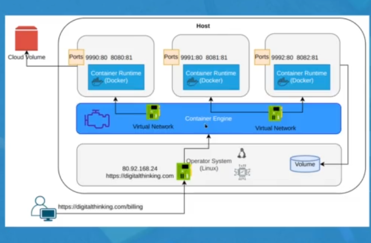

**Contenedores:** unidad de software que empaqueta codigo y dependencias necesarias para una aplicacion. |

**Imagene:** paquete ligero y ejecutable de software con todo lo necesario para la aplicacion.

**docker engine:** motor de ejecucion de contenedores.

**docker hub:** repositorio por defecto para las imagenes de docker

**podman:** alternativa de docker

**docker compose:** orquestador ligero de contenedores.

**docker swarm:** orquestador de contenedores permite manejar clusters

**kubernetes:** sistema para administracion de clusters y orquestador empresarial de contenedores.

*La image se puede definir como la lista de las operaciones que se estaran realizando

*el contenedor ya es algo en ejecucion.

se recibe una peticion

se recibe en el host (linux)

dokcer engine (docker container))

dependiendo al puerto se va al docker container.

se puede conectar a la nube o bajo un volumen(mapear unidad de almacenamiento).

## Mapeo

se puede definir como el mapeo de una carpeta host a nuestro contenedor para hacer informacion persistente.

## Redes.
